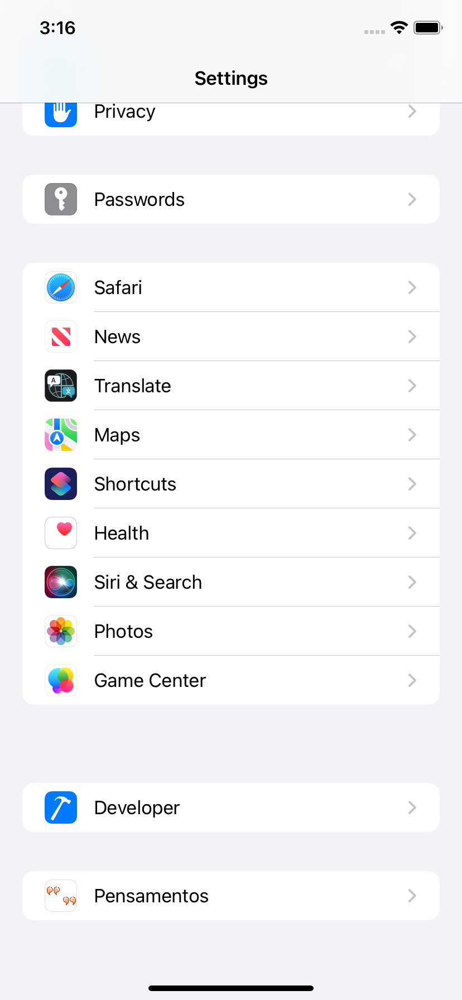

# Pensamentos
> Aplicativo para desenvolvimento Swift/iOS

Aplicativo para apresentar pensamentos famosos.

## Conceitos abordados

* Linguagem
    * Swift 5.5
    * MVC

* Auto Layout
    * Constraint
        * Content Compression Resistance Priority
    * Assets

* Components
    * UIView
    * UIImage
    * UILabel
    * UITabBar
    * UISlider
    * UISegmentedControl

* Singleton
    * Variáveis
    * Variáveis computadas
    * Enum

* Recursos
    * Fontes customizadas
    * NotificationCenter
        * Mecanismo de disparo de notificações que permite a transmissão de informações para observadores registrados.
    * UserDefaults
        * Tabela interna para guardar pequenas quantidades de informações em formato de Property List, sendo:
          BOOL   |  INT  |  STRING |  DOUBLE  |  DATA  |  DICTONARY  |  ARRAY
 
          As informações ficam persistidas enquanto o app estiver instalado, não possuem segurança, nem criptografia.
    * JSON
    * Bundle
        * Diretório no sistema de arquivos que agrupa código executável e demais recursos como imagens, sons e etc em um único lugar, com uma estrutura hierárquica padrão.
 
          É nele que se encontra todos os recursos locais usados em um aplicativo, como  o **info.plist**.
 
          Cada tipo de recurso fica localizado em uma pasta apropriada, como por exemplo, a pasta Resource para imagens e sons. Estas pastas podem ser localizadas.
 
          Quando adiciona um arquivo e na tela o "add to targets" esta selecionado ele é adicionado ao Bundle - o que permite ser recuperado pelo *Bundle.main.url()*
 

## Snapshots

